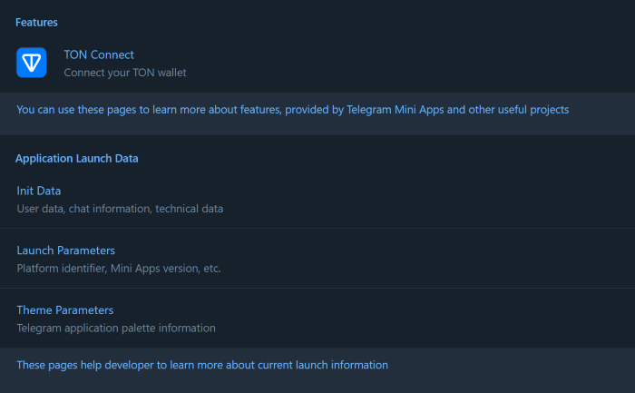

# Telegram Mini Apps React Template

This template demonstrates how developers can implement a single-page application on the Telegram
Mini Apps platform using the following technologies and libraries:

- [React](https://react.dev/)
- [TypeScript](https://www.typescriptlang.org/)
- [TON Connect](https://docs.ton.org/develop/dapps/ton-connect/overview)
- [@telegram-apps SDK](https://docs.telegram-mini-apps.com/packages/telegram-apps-sdk)
- [Telegram UI](https://github.com/Telegram-Mini-Apps/TelegramUI)
- [Vite](https://vitejs.dev/)

> The template was created using [npm](https://www.npmjs.com/). Therefore, it is required to use
> it for this project as well. Using other package managers, you will receive a corresponding error.

## Install Dependencies

If you have just cloned this template, you should install the project dependencies using the
command:

```Bash
npm install
```

## Scripts

This project contains the following scripts:

- `dev`. Runs the application in development mode.
- `build`. Builds the application for production.
- `lint`. Runs [eslint](https://eslint.org/) to ensure the code quality meets the required
  standards.
- `deploy`. Deploys the application to GitHub Pages.

To run a script, use the `npm run` command:

```Bash
npm run {script}
# Example: npm run build
```

## Create Bot and Mini App

Before you start, make sure you have already created a Telegram Bot. Here is
a [comprehensive guide](https://docs.telegram-mini-apps.com/platform/creating-new-app) on how to
do it.

## Run

Although Mini Apps are designed to be opened
within [Telegram applications](https://docs.telegram-mini-apps.com/platform/about#supported-applications),
you can still develop and test them outside of Telegram during the development process.

To run the application in the development mode, use the `dev` script:

```bash
npm run dev
```

After this, you will see a similar message in your terminal:

```bash
VITE v5.2.12  ready in 237 ms

➜  Local:   http://localhost:5173/reactjs-template
➜  Network: http://172.18.16.1:5173/reactjs-template
➜  Network: http://172.19.32.1:5173/reactjs-template
➜  Network: http://192.168.0.171:5173/reactjs-template
➜  press h + enter to show help
```

Here, you can see the `Local` link, available locally, and `Network` links accessible to all
devices in the same network with the current device.

To view the application, you need to open the `Local`
link (`http://localhost:5173/reactjs-template` in this example) in your browser:



It is important to note that some libraries in this template, such as `@telegram-apps/sdk`, are not
intended for use outside of Telegram.

Nevertheless, they appear to function properly. This is because the `src/mockEnv.ts` file, which is
imported in the application's entry point (`src/index.ts`), employs the `mockTelegramEnv` function
to simulate the Telegram environment. This trick convinces the application that it is running in a
Telegram-based environment. Therefore, be cautious not to use this function in production mode
unless you fully understand its implications.

## Creating a Telegram WebApp After Setting Up a Bot

Once you've created your bot and passed your website URL, it is necessary to create a WebApp in order to directly open the mini app within Telegram.

To create a new app, follow this guide: https://docs.telegram-mini-apps.com/platform/creating-new-app#direct-link

## Retrieving  startParam from the URL

 Navigate to the LaunchParamsPage folder. Inside, you'll find a file named LaunchParamsPage.tsx. This file demonstrates how to retrieve the startParam from the URL.

## Demo MiniApp URL

https://t.me/rohit_learn_bot/LearnMiniApp?startapp=ABC

    rohit_learn_bot is the bot username.
    LearnMiniApp is the WebApp name.
    The startapp=ABC parameter is passed, and when the app is launched, you can retrieve this parameter. Refer to the instructions above for how to extract this parameter in your mini app.

You can store this parameter for any purpose, but for demonstration purposes, I’m displaying it on the frontend.


### Run Inside Telegram

Although it is possible to run the application outside of Telegram, it is recommended to develop it
within Telegram for the most accurate representation of its real-world functionality.

To run the application inside Telegram, [@BotFather](https://t.me/botfather) requires an HTTPS link.

This template already provides a solution.

Navigate to the `vite.config.ts` file and uncomment the usage of the `basicSsl` function. This
function utilizes
the [@vitejs/plugin-basic-ssl](https://www.npmjs.com/package/@vitejs/plugin-basic-ssl) plugin, which
enables the creation of an HTTPS link. Note that this plugin generates a self-signed certificate,
which browsers will recognize as unsafe, resulting in a warning when accessing the app.

After uncommenting the function, run the `dev` script again and observe the output in your terminal:

```bash
VITE v5.2.12  ready in 265 ms

➜  Local:   https://localhost:5173/reactjs-template
➜  Network: https://172.18.16.1:5173/reactjs-template
➜  Network: https://172.19.32.1:5173/reactjs-template
➜  Network: https://192.168.0.171:5173/reactjs-template
➜  press h + enter to show help
```

Visiting the `Local` link (`https://localhost:5173/reactjs-template` in this example) in your
browser, you will see the following warning:


This browser warning is normal and can be safely ignored as long as the site is secure. Click
the `Proceed to localhost (unsafe)` button to continue and view the application.

Once the application is displayed correctly, submit one of the `Network` links as the Mini App link
to [@BotFather](https://t.me/botfather). Then, navigate
to [https://web.telegram.org/k/](https://web.telegram.org/k/), find your bot, and launch the
Telegram Mini App. This approach provides the full development experience.

> **Important**
>
> Because we are using self-signed SSL certificates, the Android and iOS Telegram applications will
> not be able to display the application. These operating systems enforce stricter security
> measures, preventing the Mini App from loading. To address this issue, refer
> to [this guide](https://docs.telegram-mini-apps.com/platform/getting-app-link#remote).


## TON Connect

This boilerplate utilizes the [TON Connect](https://docs.ton.org/develop/dapps/ton-connect/overview)
project to demonstrate how developers can integrate functionality related to TON cryptocurrency.

The TON Connect manifest used in this boilerplate is stored in the `public` folder, where all
publicly accessible static files are located. Remember
to [configure](https://docs.ton.org/develop/dapps/ton-connect/manifest) this file according to your
project's information.

## Useful Links

- [Platform documentation](https://docs.telegram-mini-apps.com/)
- [@telegram-apps/sdk-react documentation](https://docs.telegram-mini-apps.com/packages/telegram-apps-sdk-react)
- [Telegram developers community chat](https://t.me/devs)
